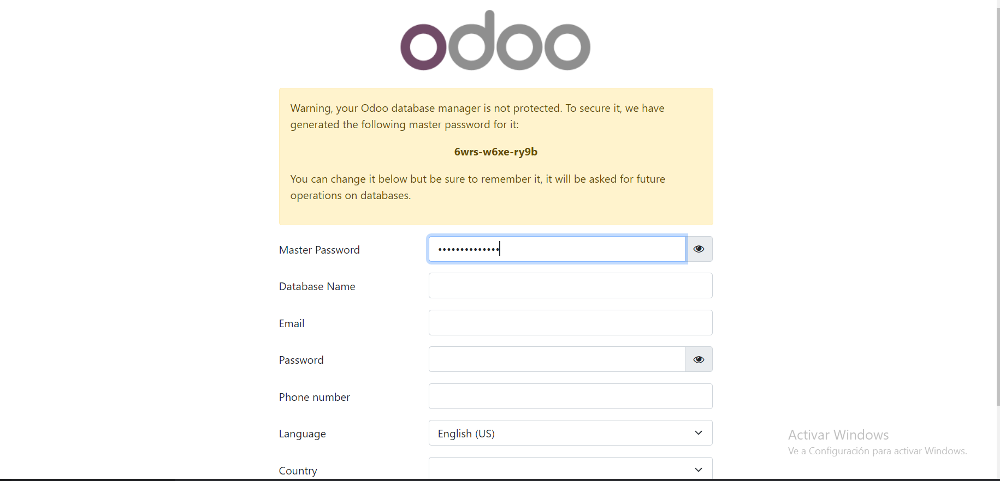
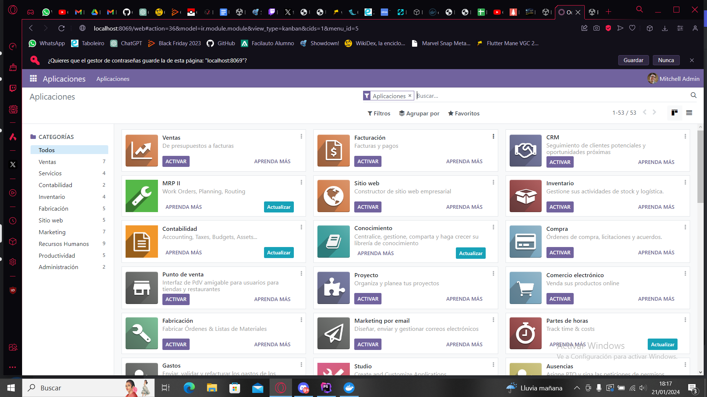

### Tarea: Instalación de Odoo con Docker Compose

## Primer Paso Docker Compose:

- Hacemos un docker-compose tal y como esta explicado a continuación.

```yml
version: '3.1'
```
* Esta línea especifica la versión de Docker Compose que se está utilizando. En este caso, es la versión 3.1.

```yml
services:
```
* Define los servicios que compondrán la aplicación. En este caso, hay dos servicios: `web` (para Odoo) y `mydb` (para PostgreSQL).

```yml
  web:
    image: odoo:16.0
```
* El servicio `web` utiliza la imagen `odoo:16.0` de Docker Hub. Esto descargará la imagen de Odoo en su versión 16.0 desde el registro público de Docker Hub.

```yml
    depends_on:
      - mydb
```
* Establece una dependencia entre el servicio `web` y el servicio `mydb`. Esto significa que el servicio `web` no arrancará hasta que el servicio `mydb` esté en funcionamiento.

```yml
    ports:
      - "8069:8069"
```
* Mapea el puerto 8069 del host al puerto 8069 del contenedor. Esto permite acceder a la interfaz web de Odoo desde la máquina local en el puerto 8069.

```yml
    environment:
      - HOST=mydb
      - USER=odoo
      - PASSWORD=myodoo
```
* Establece variables de entorno para la aplicación Odoo. Aquí se definen el host de la base de datos (`mydb`), el usuario de la base de datos (`odoo`), y la contraseña (`myodoo`).

```yml
  mydb:
    image: postgres:15
```
* El servicio `mydb` utiliza la imagen `postgres:15` de Docker Hub. Descargará la imagen de PostgreSQL en su versión 15 desde el registro público de Docker Hub.

```yml
    ports:
      - "5432:5432"
```
* Mapea el puerto 5432 del host al puerto 5432 del contenedor. Esto permite acceder a la base de datos PostgreSQL desde la máquina local en el puerto 5432.
* ¿Que ocurre si en el ordenador local el puerto 5432 está ocupado? ¿Como lo puedes solucionar?
* Si el puerto 5432 está ocupado en tu máquina local, puedes cambiar el mapeo de puertos en el servicio mydb dentro del archivo docker-compose.yml. Asegúrate de ajustar también las variables de entorno en consecuencia.

```yml
    environment:
      - POSTGRES_DB=postgres
      - POSTGRES_PASSWORD=myodoo
      - POSTGRES_USER=odoo
```
## Segundo Paso Levantar el Contenedor:
* Ejecutamos el siguiente comando para levantar el contenedor.
```bash
docker-compose up -d
```

## Tercer Paso Conectar El IDE Al contenedor:
* Creamos una base de postgres en el IDE y ponemos los datos que pusimos en el contenedor para conectarlo a esta

## Cuarto Paso Comprobar Odoo:
* Entramos a la url http://localhost:8069 y comprobamos que funciona correctamente.
* 
* Entramos con el nombre de la base de datos, una contraseña y un correo electrónico.
* 
* Odoo ya esta instalado y listo para usar.

